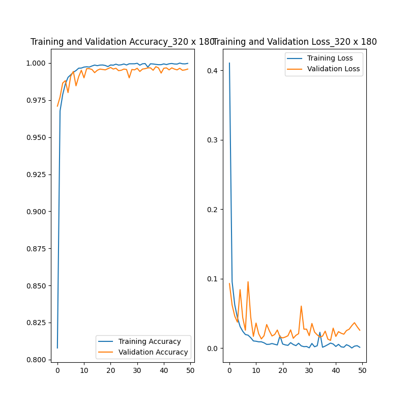
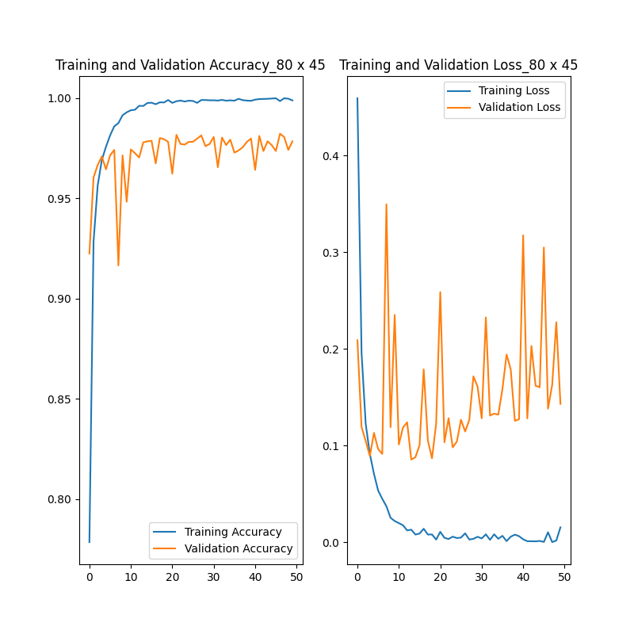
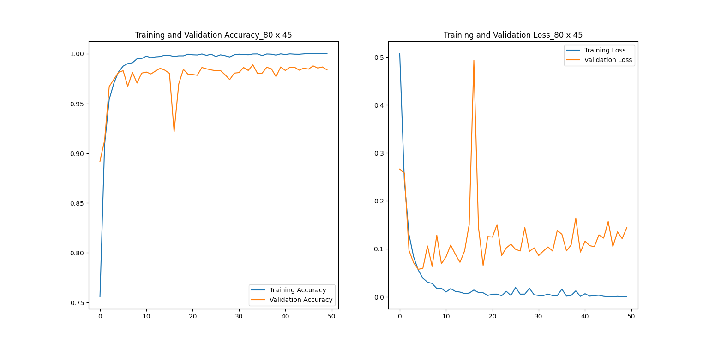

# Embedded NN Project

|               |                                 |
|---------------|---------------------------------|
|Authors        |Mickaël JALES, Pierre GARREAU    |
|Status         |Under development                |
|Description    |Embedded Neural Network project dealing with grapvine leaves dataset for early detection and classification of esca disease in vineyards. This code is meant to be executed on STM32L439 board |
|Project        |ISMIN 3A - Embedded IA           |

# Table of contents

[Introduction](#Introduction)  
1. [Model generation](#1-model-generation)  
   1. [Data augmentation](#11-data-augmentation) 
   2. [Data preprocessing](#12-data-preprocessing)
   3. [First model training](#13-first-model-training)  
   4. [Numpy arrays creation](#14-numpy-arrays-creation) 
   5. [Second model training](#15-second-model-training)
2. [Model embedding](#2-model-embedding)  
   1. [STM32CubeMX code generation](#21-stm32cubemx-code-generation)  
   2. [Application implementation](#22-application-implementation)   
3. [Test on device](#3-test-on-device)  
   1. [Communication scripts](#32-communication-scripts)   
   2. [Example with small model](#32-example-with-small-model)  
4. [Adversarial attack](#4-adversarial-attack)  
  
[Conclusion](#Conclusion)  

# Introduction

## Project overview
In this repository, you will find a project led by Mickaël JALES and Pierre GARREAU dealing with the creation of an AI-based model for early detection and classification of esca disease in vineyards. This model is meant to be embedded on a STM32L439-Discovery board. The purpose of this work is to understand the constraints and limitations of creating an embedded artificial intelligence model.  

Thanks to STMicroelectronics, we have a [dataset containing 1770 photographs of grapvine](https://data.mendeley.com/datasets/89cnxc58kj/1) splited into 2 classes: esca and healthy. Notice that we have 3 different datasets in order to build 3 different models. The diffrence between these datasets is the dimensions of photographs. Hence, we are going to train 3 models - small, medium and large - and the only difference between these models is the size of the input.  

First, we will present the generation of the model. Then, we will look at the embedding of the model on the board and the potential issues we have been through. We will then test the small model on the board as it is the only one that is small enough to be embedded on the board. To finish, we will present an adversarial attack inspired of a simple collab notebook.


## Requirements for python environment

In order to work in this project, we advise you to create a virtual environment to work on the project. To do this, create an environment at the root of the project with the following commands: 

```python
python -m venv envML
```  
*your version of python should be < 3.10, so take care to compile this line with the proper version*

Then, if your are on Windows, enter the following command:
```python
envML/Scripts/Activate.ps1      # allows to use the virtual python working environment
``` 

Otherwise, enter the following command:
```python
source envML/bin/activate
``` 

If you want to desactivate the virtual python environment, enter the following command:
```python
deactivate                  # disable the environment
```

WARINING: you might have a policy issue with powershell on windows, use the following commands to either enable or disable the restrictions:

```python
Set-ExecutionPolicy -Scope "CurrentUser" -ExecutionPolicy "Unrestricted" # to disable the restrictions

Set-ExecutionPolicy -Scope "CurrentUser" -ExecutionPolicy "RemoteSigned" # to enable the restrictions
```

Then, you can install the necessary packages in your own virtual environment using the following command:

```python
pip install -r requirements.txt
```

INFO: in .gitignore, this python virtual environment we just installed is ignored.


# 1. Model generation

In this part, we will first increase the size of the dataset by modifying the grapvine photos, then we will pre-process the data in order to train our model.  With our dataset, we can make three models: *large*, *medium* and *small* where the difference is the size of the colored photos and therefore the number of data.

## 1.1. Data augmentation

First, you have to download the pictures of diseased vines on the [following link](https://data.mendeley.com/datasets/89cnxc58kj/1). You have the pictures divided in 2 categories, the vines that have the disease *esca* and the vines *healthy*.

Once you upload these photos, you have 1770 photos of vines, 888 *esca* and 882 *healthy*. However, this is not enough to train a neural network. To increase this dataset, we are going to make some modifications on the photos to have more data.<br>
For that, we will use the library *tensorflow.keras.preprocessing.image* to apply transformations to the images. For example, blur the image, turn it upside down, saturate the photo ... <br>
There are 14 transformations which increases our dataset to 24780 photos and we have now more data for our neural network.

This augmentation script is available [here](/src/data_processing/esca_dataset_augmentation.py).

## 1.2. Data preprocessing

Now that we have a dataset with enough data, we will separate it into three sub-datasets, *train*, *test* and *validation*. The *train* dataset contains **60%** of the original dataset or 14868 photos, the *test* dataset contains **25%** of the dataset or 6195 photos and finally the *validation* dataset contains **15%** of the dataset or 3717 photos.

```python
number of images for class:  
  [esca healthy] = [12432 12348] 

split of dataset:
  esca [train validation test] = [[7459 1865 3108]
  healthy [train validation test] = [7409 1852 3087]]
 ```


The fact of dividing the dataset in three allows us to train the model on the *train dataset*, to validate this model with the *validation dataset* and finally, we can test our model on the *test dataset*. <br>
Indeed, to train a good model, it is necessary that this model does not keep in memory photos that it has already seen.

This pre-processing script is available [here](/src/data_processing/esca_dataset_preprocessing.py).

## 1.3. First model training

To train the model, we use the *tensorflow* and *keras* libraries. As said before, we will make three models: *large*, *medium* et *small* where only the size changes.

The *large* model was far too big and the estimated time to compile the model was **70h**. For obvious reasons, we did not make the *large* model. (find the script [here](/src/model/esca_dataset_CNN_model_large.py))

The *medium* model still took us **6h to 8h**. <br>
After training the model, we get these results for *accuracy* and *loss* of *train* and *validation*: 



```python
size of images:  320 180
test_result :  [loss, accuracy ] = [0.1151105985045433, 0.9856335520744324]
```

The model shows no signs of overfitting and has a confidence of **98%**. (find the script [here](/src/model/esca_dataset_CNN_model_medium.py)) However, the problem is the size. Indeed, the *.h5* file is too big for the STM32 board and the board's RAM does not support the model. We had to use the *small* model. 

Finally, there is the *small* model.



```python
size of images:  80 45
test_result :  [loss, accuracy ] = [0.198756780076789, 0.9745625091896284]
```

We notice an overffiting due to too many aprameters. To be able to change these parameters and obtain a new model quickly, we decided to transform the photos into a numpy array to train the model. 

The script for the small model with photos is [here](/src/model/esca_dataset_CNN_model_small.py))

## 1.4. Numpy arrays creation

Training the model on the photos directly took a lot of computing power. <br>
To overcome this, we decided to transform the photos into a numpy array and train the model directly on the numpy array.

We also tried it on the *medium* model to see if it reduced the size of the model but it didn't do anything.

This creation numpy arrays script are available for the [medium model](/src/data_processing/esca_dataset_creating_dataset_model_medium.py) and the [small model](/src/data_processing/esca_dataset_creating_dataset_model_small.py).

## 1.5. Second model training

So now we tried to change the model to see if we could overcome the overfitting and we obtain this :



```python
size of images:  80 45
test_result :  [loss, accuracy ] = [0.1356278102982017, 0.9836290187362791]
```

Except for a spike at the 13rd *EPOCH*, our model does not overfit too much. <br>
And so this is the model we put on the STM32 board.

This small model script is available [here](/src/model/esca_dataset_creating_dataset_model_medium.py) and the [small model](/src/data_processing/esca_dataset_CNN_model_small_numpy.py).

# 2. Model embedding

In this part, we will first generate the code thanks to the .h5 file created by our model training in the previous part and thanks to a software package in STM32CubeMX. Then, we will create the application that process our input and infer the class of it.  
Because only the small model is small enough to fit on the board, we will work with the small dataset and the small model.

## 2.1. STM32CubeMX code generation

First, this step requires the *model_small_b32.h5* file obtained in the previous part. Then, we can open STM32CubeMX and create a new project - we called it *esca_dataset_small*. We will first choose our board in the **Board Selector** section by typing **STM32L4R9I-DISCO** and initialize the peripharials with their default mode.


Then, by pressing **Alt + O**, we will open the Select Component window of the Software Pack tab. In this window, we need first to install **STMicroelectronics.X-CUBE-AI** package - if not already installed - and then, check the following boxes:


In the **Pinout and Configuration** section, a new category has been added at the end of the list: **Software Packs**. Open this category and click the **+** button next to **Main**. You can now configure this section as following:


By clicking on Analyze, we will tell X-Cube-AI to analyze our network so that STM32CubeMX can generate our code afterwards. Once the analyze is complete, we can go to **Project Manager** and configure the name of our project, and set **STM32CubeIDE** as our default IDE. Then, we can generate the code and start working on the application.

## 2.2. Application implementation

In this part, we will start from an application already developed for another model: MNIST model. Hence, our application is highly inspired of this file. However, there are several changes in the **MX_X_CUBE_AI_Process** function as MNIST deals with 28x28 black and white images and our small model with 80x45 RGB images. By the way, our pictures are represented by 80x45x3 float32, and we will send only bytes in the serial port. Hence, we chose to send bytes 4 by 4 in the serial port. This allows us to send a number of our array per communication. The input numbers recieved are gathered in a list. We chose to sort the numbers as following:

```python	
data = [data_red_0_0, data_green_0_0, data_blue_0_0, data_red_0_1, data_green_0_1, data_blue_0_1 ...]
```

We store the red value, then the blue value, then the green value of each pixel of the image and we store the first line of pixel, then the second, and so on. Once the inference has been completed, we can send the infered class to serial.

Our final application code is available [here](/files/app_x-cube-ai.c).

# 3. Test on device

## 3.1. Communication scripts

In this step, we will use a template of a communication script created for the MNIST model, and we will adapt the communication script the same way we adapted the application code in the previous part.

In this part, we will send an input image coming from the test folder created during the model generation. We need first to open the serial port to communicate with the board. Then, we will load our model thanks to the .h5 file, we will also load 2 numpy arrays containing testing data: *x_test* data and *y_test* arrays.

Then, for each inference - in our example, there will be only one inference -, we will:  
- pick a random input in the numpy array input *x_test*
- start the synchronization with the board by sending a flag in the serial port.
- once the board synchronized itself with our communication script, start sending the numbers of the input image, one by one.
- wait for the board to send in the serial port the flag meaning it had completed the inference.
- read the probabilities for each class sent by the board and print them to the user.
  
This communication script is available for the [medium model](/src/communication/communication_STM32_esca_dataset_model_medium.py) and the [small model](/src/communication/communication_STM32_esca_dataset_model_small.py).

## 3.2. Example with small model

By launching the communication script for small model, we can test our model. In this script, you need to make sure that the right COM port is being opened - line 173. You also need to make sure that specified paths to numpy arrays for *x_test* and *y_test* are properly configured - line 180 and 181.

# 4. Adversarial attack

The purpose of this part is to adapt for our model, an attack created on a famous tensorflow model. In this attack, we will change the input image and add perturbation to it. We will then add more or less preturbation to the image and see how our model behaves.

The notebook for this attack can be found [here](/src/adversarial_fgsm/adversarial_fgsm_vineyard_small.ipynb).

# Conclusion
