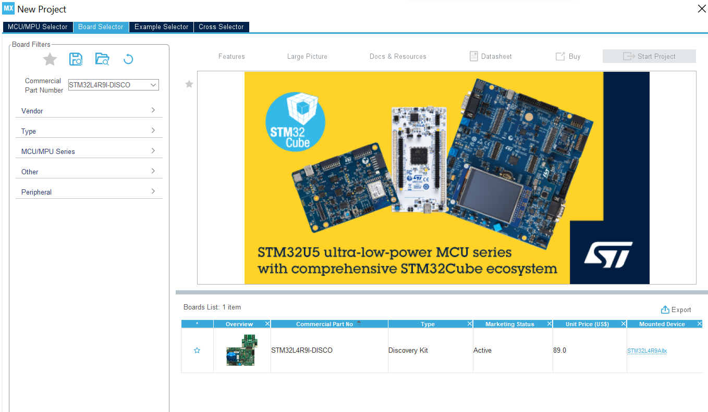
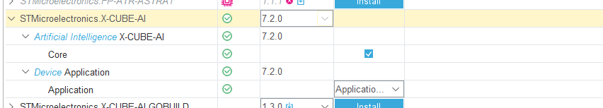
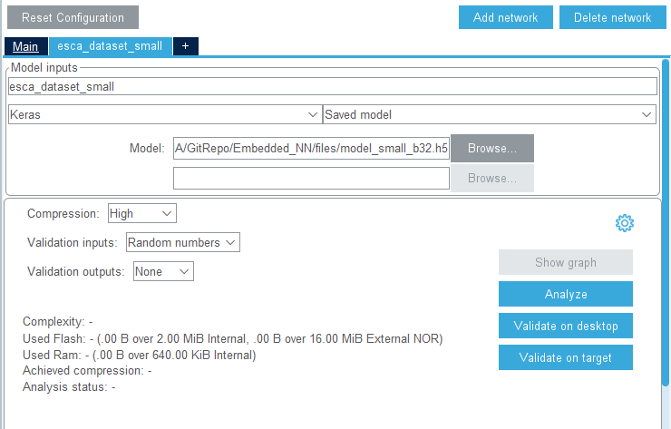

# Embedded NN Project

|               |                                 |
|---------------|---------------------------------|
|Authors        |Mickaël JALES, Pierre GARREAU    |
|Status         |Under development                |
|Description    |Embedded Neural Network project dealing with grapevine leaves dataset for early detection and classification of esca disease in vineyards. This code is meant to be executed on STM32L439 board |
|Project        |ISMIN 3A - Embedded IA           |

# Table of contents

[Introduction](#Introduction)  
1. [Model generation](#1-model-generation)  
1. [Model embedding](#2-model-embedding)  
2. [Test on device](#3-test-on-device)  
3. [Adversarial attack](#4-adversarial-attack)  
  
[Conclusion](#Conclusion)  

# Introduction

## Project overview
In this repository, you will find a project led by Mickaël JALES and Pierre GARREAU dealing with the creation of an AI-based model for early detection and classification of esca disease in vineyards. This model is meant to be embedded on a STM32L439-Discovery board. The purpose of this work is to understand the constraints and limitations of creating an embedded artificial intelligence model.  

Thanks to STMicroelectronics, we have a [dataset containing 1600 photographs of grapvine](https://data.mendeley.com/datasets/89cnxc58kj/1) splited into 2 classes: esca and healthy. Notice that we have 3 different datasets in order to build 3 different models. The diffrence between these datasets is the dimensions of photographs. Hence, we are going to train 3 models - small, medium and large - and the only difference between these models is the size of the input.  

First, we will present the generation of the model. Then, we will look at the embedding of the model on the board and the potential issues we have been through. We will then test the small model on the board as it is the only one that is small enough to be embedded on the board. To finish, we will present an adversarial attack inspired of a simple collab notebook.


## Requirements for python environment

In order to work in this project, we advise you to create a virtual environment to work on the project. To do this, create an environment at the root of the project with the following commands: 

```python
python -m venv envML
```  
*your version of python should be < 3.10, so take care to compile this line with the proper version*

Then, if your are on Windows, enter the following command:
```python
envML/Scripts/Activate.ps1      # allows to use the virtual python working environment
``` 

Otherwise, enter the following command:
```python
source envML/bin/activate
``` 

If you want to desactivate the virtual python environment, enter the following command:
```python
deactivate                  # disable the environment
```

WARINING: you might have a policy issue with powershell on windows, use the following commands to either enable or disable the restrictions:

```python
Set-ExecutionPolicy -Scope "CurrentUser" -ExecutionPolicy "Unrestricted" # to disable the restrictions

Set-ExecutionPolicy -Scope "CurrentUser" -ExecutionPolicy "RemoteSigned" # to enable the restrictions
```

Then, you can install the necessary packages in your own virtual environment using the following command:

```python
pip install -r requirements.txt
```

INFO: in .gitignore, this python virtual environment we just installed is ignored.

# 1. Model generation

## 1.1. Data preprocessing
## 1.2. Data augmentation
## 1.3. Numpy arrays creation
## 1.4. Model training

# 2. Model embedding

In this part, we will first generate the code thanks to the .h5 file created by our model training in the previous part and thanks to a software package in STM32CubeMX. Then, we will create the application that process our input and infer the class of it.  
Because only the small model is small enough to fit on the board, we will work with the small dataset and the small model.

## 2.1. STM32CubeMX code generation

First, this step requires the *model_small_b32.h5* file obtained in the previous part. Then, we can open STM32CubeMX and create a new project - we called it *esca_dataset_small*. We will first choose our board in the **Board Selector** section by typing **STM32L4R9I-DISCO** and initialize the peripharials with their default mode.



Then, by pressing **Alt + O**, we will open the Select Component window of the Software Pack tab. In this window, we need first to install **STMicroelectronics.X-CUBE-AI** package - if not already installed - and then, check the following boxes:



In the **Pinout and Configuration** section, a new category has been added at the end of the list: **Software Packs**. Open this category and click the **+** button next to **Main**. You can now configure this section as following:



By clicking on Analyze, we will tell X-Cube-AI to analyze our network so that STM32CubeMX can generate our code afterwards. Once the analyze is complete, we can go to **Project Manager** and configure the name of our project, and set **STM32CubeIDE** as our default IDE. Then, we can generate the code and start working on the application.

## 2.2. Application implementation

In this part, we will start from an application already developed for another model: MNIST model. Hence, our application is highly inspired of this file. However, there are several changes in the **MX_X_CUBE_AI_Process** function as MNIST deals with 28x28 black and white images and our small model with 80x45 RGB images. By the way, our pictures are represented by 80x45x3 float32, and we will send only bytes in the serial port. Hence, we chose to send bytes 4 by 4 in the serial port. This allows us to send a number of our array per communication. The input numbers recieved are gathered in a list. We chose to sort the numbers as following:

```python	
data = [data_red_0_0, data_green_0_0, data_blue_0_0, data_red_0_1, data_green_0_1, data_blue_0_1 ...]
```

We store the red value, then the blue value, then the green value of each pixel of the image and we store the first line of pixel, then the second, and so on. Once the inference has been completed, we can send the infered class to serial.

Our final application code is available [here](/files/app_x-cube-ai.c).

# 3. Test on device

## 3.1. Communication scripts

In this step, we will use a template of a communication script created for the MNIST model, and we will adapt the communication script the same way we adapted the application code in the previous part.

In this part, we will send an input image coming from the test folder created during the model generation. We need first to open the serial port to communicate with the board. Then, we will load our model thanks to the .h5 file, we will also load 2 numpy arrays containing testing data: *x_test* data and *y_test* arrays.

Then, for each inference - in our example, there will be only one inference -, we will:  
- pick a random input in the numpy array input *x_test*
- start the synchronization with the board by sending a flag in the serial port.
- once the board synchronized itself with our communication script, start sending the numbers of the input image, one by one.
- wait for the board to send in the serial port the flag meaning it had completed the inference.
- read the probabilities for each class sent by the board and print them to the user.
  
This communication script is available for the [medium model](/src/communication/communication_STM32_esca_dataset_model_medium.py) and the [small model](/src/communication/communication_STM32_esca_dataset_model_small.py).

## 3.2. Example with small model

# 4. Adversarial attack
# Conclusion

## PREPROCESSING

set_samples:  ['train', 'validation', 'test'] 

class:  ['esca' 'healthy']

number of images for class:  [12432 12348] 

split of dataset:
  [[7459 1865 3108]
 [7409 1852 3087]]

## MODEL SMALL

Model: "sequential"
_________________________________________________________________
 Layer (type)                Output Shape              Param #
=================================================================
 conv2d (Conv2D)             (None, 80, 45, 32)        896

 activation (Activation)     (None, 80, 45, 32)        0

 max_pooling2d (MaxPooling2D  (None, 40, 22, 32)       0
 )

 conv2d_1 (Conv2D)           (None, 40, 22, 32)        9248

 activation_1 (Activation)   (None, 40, 22, 32)        0

 max_pooling2d_1 (MaxPooling  (None, 20, 11, 32)       0
 2D)

 conv2d_2 (Conv2D)           (None, 20, 11, 64)        18496

 activation_2 (Activation)   (None, 20, 11, 64)        0

 max_pooling2d_2 (MaxPooling  (None, 10, 5, 64)        0
 2D)

 conv2d_3 (Conv2D)           (None, 10, 5, 64)         36928

 activation_3 (Activation)   (None, 10, 5, 64)         0

 max_pooling2d_3 (MaxPooling  (None, 5, 2, 64)         0
 2D)

 conv2d_4 (Conv2D)           (None, 5, 2, 32)          18464

 activation_4 (Activation)   (None, 5, 2, 32)          0

 max_pooling2d_4 (MaxPooling  (None, 2, 1, 32)         0
 2D)

 flatten (Flatten)           (None, 64)                0

 dense (Dense)               (None, 64)                4160

 activation_5 (Activation)   (None, 64)                0

 dropout (Dropout)           (None, 64)                0

 dense_1 (Dense)             (None, 2)                 130

 activation_6 (Activation)   (None, 2)                 0

=================================================================
Total params: 88,322
Trainable params: 88,322
Non-trainable params: 0
_________________________________________________________________

size of images:  80 45
test_result:  [0.5534958243370056, 0.9627118706703186]

## MODEL MEDIUM


Model: "sequential"
_________________________________________________________________
 Layer (type)                Output Shape              Param #
=================================================================
 conv2d (Conv2D)             (None, 320, 180, 32)      896

 activation (Activation)     (None, 320, 180, 32)      0

 max_pooling2d (MaxPooling2D  (None, 160, 90, 32)      0
 )

 conv2d_1 (Conv2D)           (None, 160, 90, 32)       9248

 activation_1 (Activation)   (None, 160, 90, 32)       0

 max_pooling2d_1 (MaxPooling  (None, 80, 45, 32)       0
 2D)

 conv2d_2 (Conv2D)           (None, 80, 45, 64)        18496

 activation_2 (Activation)   (None, 80, 45, 64)        0

 max_pooling2d_2 (MaxPooling  (None, 40, 22, 64)       0
 2D)

 conv2d_3 (Conv2D)           (None, 40, 22, 64)        36928

 activation_3 (Activation)   (None, 40, 22, 64)        0

 max_pooling2d_3 (MaxPooling  (None, 20, 11, 64)       0
 2D)

 conv2d_4 (Conv2D)           (None, 20, 11, 32)        18464

 activation_4 (Activation)   (None, 20, 11, 32)        0

 max_pooling2d_4 (MaxPooling  (None, 10, 5, 32)        0
 2D)

 flatten (Flatten)           (None, 1600)              0

 dense (Dense)               (None, 64)                102464

 activation_5 (Activation)   (None, 64)                0

 dropout (Dropout)           (None, 64)                0

 dense_1 (Dense)             (None, 2)                 130

 activation_6 (Activation)   (None, 2)                 0

=================================================================
Total params: 186,626
Trainable params: 186,626
Non-trainable params: 0
_________________________________________________________________

size of images:  320 180
test_result:  [0.1151105985045433, 0.9856335520744324]


# MODEL LARGE 

Not available 

# Report STM32CubeMX

 Exec/report summary (analyze) 
 ------------------------------------------------------------------------------------------------------------------------ 
 model file           : C:\Users\micka\OneDrive\Bureau\S9\Conception système\Embedded AI\TP Vineyards\Embedded_NN\h5\model_medium_b32.h5 
 type                 : keras 
 c_name               : esca_dataset 
 compression          : none 
 allocator strategy   : ['allocate-inputs', 'allocate-outputs'] 
 workspace dir        : C:\Users\micka\AppData\Local\Temp\mxAI_workspace40651933305007271951562690200797 
 output dir           : C:\Users\micka\.stm32cubemx\esca_dataset_output 
 model_name           : model_medium_b32 
 model_hash           : ae581571eabbdcb124ac518e30dff09a 
 input 1/1            : 'input_0' 
                        172800 items, 675.00 KiB, ai_float, float, (1,320,180,3), domain:activations/**default** 
 output 1/1           : 'activation_6' 
                        2 items, 8 B, ai_float, float, (1,1,1,2), domain:activations/**default** 
 params #             : 186,626 items (729.01 KiB) 
 macc                 : 290,620,032 
 weights (ro)         : 746,504 B (729.01 KiB) (1 segment) 
 activations (rw)     : 1,933,840 B (1.84 MiB) (1 segment) * 
 ram (total)          : 1,933,840 B (1.84 MiB) = 1,933,840 + 0 + 0 
  
 (*) input/output buffers can be used from the activations buffer 
  
 Model name - model_medium_b32 ['input_0'] ['activation_6'] 
 ------------------------------------------------------------------------------------------------------------------ 
 id   layer (original)                 oshape                      param/size        macc          connected to    
 ------------------------------------------------------------------------------------------------------------------ 
 0    input_0 (None)                   [b:None,h:320,w:180,c:3]                                                    
      conv2d_conv2d (Conv2D)           [b:None,h:320,w:180,c:32]   896/3,584         49,766,432    input_0         
 ------------------------------------------------------------------------------------------------------------------ 
 1    activation (Activation)          [b:None,h:320,w:180,c:32]                     1,843,200     conv2d_conv2d   
 ------------------------------------------------------------------------------------------------------------------ 
 2    max_pooling2d (MaxPooling2D)     [b:None,h:160,w:90,c:32]                      1,843,200     activation      
 ------------------------------------------------------------------------------------------------------------------ 
 3    conv2d_1_conv2d (Conv2D)         [b:None,h:160,w:90,c:32]    9,248/36,992      132,710,432   max_pooling2d   
 ------------------------------------------------------------------------------------------------------------------ 
 4    activation_1 (Activation)        [b:None,h:160,w:90,c:32]                      460,800       conv2d_1_conv2d 
 ------------------------------------------------------------------------------------------------------------------ 
 5    max_pooling2d_1 (MaxPooling2D)   [b:None,h:80,w:45,c:32]                       460,800       activation_1    
 ------------------------------------------------------------------------------------------------------------------ 
 6    conv2d_2_conv2d (Conv2D)         [b:None,h:80,w:45,c:64]     18,496/73,984     66,355,264    max_pooling2d_1 
 ------------------------------------------------------------------------------------------------------------------ 
 7    activation_2 (Activation)        [b:None,h:80,w:45,c:64]                       230,400       conv2d_2_conv2d 
 ------------------------------------------------------------------------------------------------------------------ 
 8    max_pooling2d_2 (MaxPooling2D)   [b:None,h:40,w:22,c:64]                       225,280       activation_2    
 ------------------------------------------------------------------------------------------------------------------ 
 9    conv2d_3_conv2d (Conv2D)         [b:None,h:40,w:22,c:64]     36,928/147,712    32,440,384    max_pooling2d_2 
 ------------------------------------------------------------------------------------------------------------------ 
 10   activation_3 (Activation)        [b:None,h:40,w:22,c:64]                       56,320        conv2d_3_conv2d 
 ------------------------------------------------------------------------------------------------------------------ 
 11   max_pooling2d_3 (MaxPooling2D)   [b:None,h:20,w:11,c:64]                       56,320        activation_3    
 ------------------------------------------------------------------------------------------------------------------ 
 12   conv2d_4_conv2d (Conv2D)         [b:None,h:20,w:11,c:32]     18,464/73,856     4,055,072     max_pooling2d_3 
 ------------------------------------------------------------------------------------------------------------------ 
 13   activation_4 (Activation)        [b:None,h:20,w:11,c:32]                       7,040         conv2d_4_conv2d 
 ------------------------------------------------------------------------------------------------------------------ 
 14   max_pooling2d_4 (MaxPooling2D)   [b:None,h:10,w:5,c:32]                        6,400         activation_4    
 ------------------------------------------------------------------------------------------------------------------ 
 15   flatten (Flatten)                [b:None,c:1600]                                             max_pooling2d_4 
 ------------------------------------------------------------------------------------------------------------------ 
 16   dense_dense (Dense)              [b:None,c:64]               102,464/409,856   102,464       flatten         
 ------------------------------------------------------------------------------------------------------------------ 
 17   activation_5 (Activation)        [b:None,c:64]                                 64            dense_dense     
 ------------------------------------------------------------------------------------------------------------------ 
 19   dense_1_dense (Dense)            [b:None,c:2]                130/520           130           activation_5    
 ------------------------------------------------------------------------------------------------------------------ 
 20   activation_6 (Activation)        [b:None,c:2]                                  30            dense_1_dense   
 ------------------------------------------------------------------------------------------------------------------ 
 model/c-model: macc=290,620,032/290,620,032  weights=746,504/746,504  activations=--/1,933,840 io=--/0 
  
 Number of operations per c-layer 
 ----------------------------------------------------------------------------------- 
 c_id    m_id   name (type)                          #op (type)                     
 ----------------------------------------------------------------------------------- 
 0       2      conv2d_conv2d (optimized_conv2d)          53,452,832 (smul_f32_f32) 
 1       5      conv2d_1_conv2d (optimized_conv2d)       133,632,032 (smul_f32_f32) 
 2       8      conv2d_2_conv2d (optimized_conv2d)        66,810,944 (smul_f32_f32) 
 3       11     conv2d_3_conv2d (optimized_conv2d)        32,553,024 (smul_f32_f32) 
 4       14     conv2d_4_conv2d (optimized_conv2d)         4,068,512 (smul_f32_f32) 
 5       16     dense_dense (dense)                          102,464 (smul_f32_f32) 
 6       17     activation_5 (nl)                                 64 (op_f32_f32)   
 7       19     dense_1_dense (dense)                            130 (smul_f32_f32) 
 8       20     activation_6 (nl)                                 30 (op_f32_f32)   
 ----------------------------------------------------------------------------------- 
 total                                                   290,620,032                
  
   Number of operation types 
   --------------------------------------------- 
   smul_f32_f32         290,619,938      100.0% 
   op_f32_f32                    94        0.0% 
  
 Complexity report (model) 
 ---------------------------------------------------------------------------------- 
 m_id   name              c_macc                    c_rom                     c_id 
 ---------------------------------------------------------------------------------- 
 2      max_pooling2d     |||||||           18.4%   |                  0.5%   [0]  
 5      max_pooling2d_1   ||||||||||||||||  46.0%   ||                 5.0%   [1]  
 8      max_pooling2d_2   ||||||||          23.0%   |||                9.9%   [2]  
 11     max_pooling2d_3   ||||              11.2%   ||||||            19.8%   [3]  
 14     max_pooling2d_4   |                  1.4%   |||                9.9%   [4]  
 16     dense_dense       |                  0.0%   ||||||||||||||||  54.9%   [5]  
 17     activation_5      |                  0.0%   |                  0.0%   [6]  
 19     dense_1_dense     |                  0.0%   |                  0.1%   [7]  
 20     activation_6      |                  0.0%   |                  0.0%   [8]  
 ---------------------------------------------------------------------------------- 
 macc=290,620,032 weights=746,504 act=1,933,840 ram_io=0 
Creating txt report file C:\Users\micka\.stm32cubemx\esca_dataset_output\esca_dataset_analyze_report.txt 
elapsed time (analyze): 2.925s 
Getting Flash and Ram size used by the library 
Model file:      model_medium_b32.h5 
Total Flash:     767904 B (749.91 KiB) 
    Weights:     746504 B (729.01 KiB) 
    Library:     21400 B (20.90 KiB) 
Total Ram:       1938036 B (1.85 MiB) 
    Activations: 1933840 B (1.84 MiB) 
    Library:     4196 B (4.10 KiB) 
    Input:       691200 B (675.00 KiB included in Activations) 
    Output:      8 B (included in Activations) 
Done
